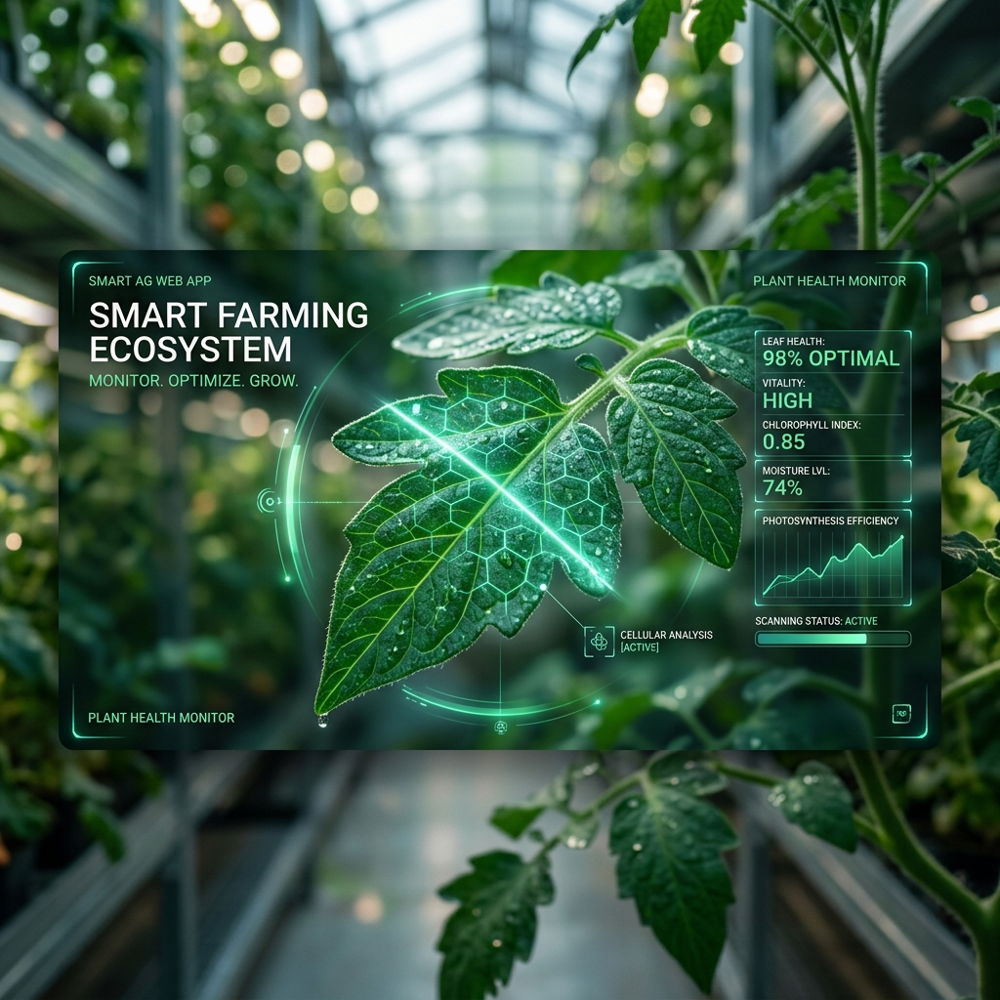
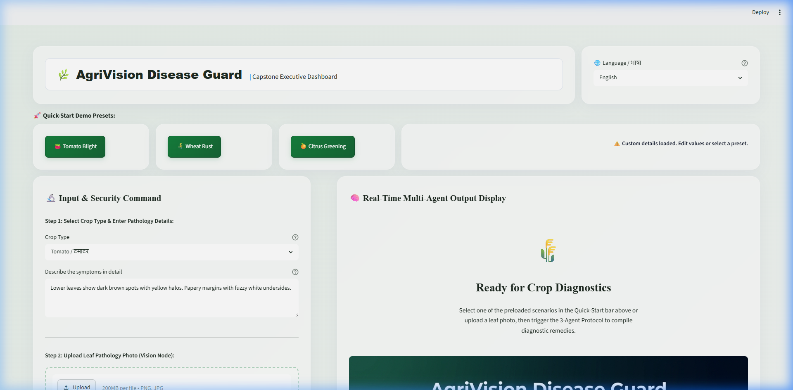
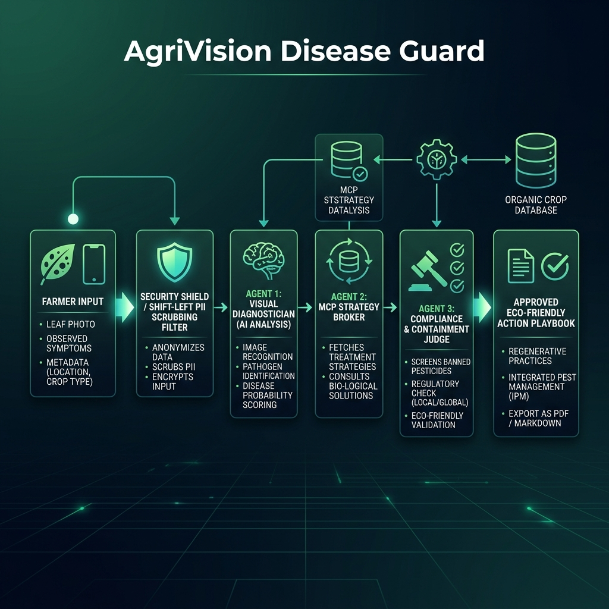

# AgriVision Disease Guard 🌿🛡️
*Kaggle 5-Day Intensive Capstone Project — "Agents for Good (Agriculture)" Track*



### 🖥️ Dashboard Interface Demo


AgriVision Disease Guard is a complete, production-ready, security-first Multi-Agent System built using the **Google Antigravity SDK** design pattern and the **ADK (Agent Development Kit) framework**. It is designed to empower small-scale, local farmers with rapid crop disease diagnosis and broker non-toxic, eco-friendly containment strategies.

---

## 📋 Problem Statement & Social Impact
Crop diseases represent a catastrophic risk to global food security. For small-scale local farmers in developing regions, the lack of immediate access to expert agronomists often means infections are identified too late, leading to crop failure, financial ruin, and increased food insecurity.

Early, local-first disease detection scales equity by putting professional-grade diagnosis and organic mitigation guidelines directly into the hands of local farmers. By utilizing local databases of **Universal Design for Agriculture (UDA)** compliant practices, AgriVision Disease Guard provides high-fidelity, non-toxic recommendations, ensuring environmental sustainability while protecting the farmer's yield.

---

## 🚀 Key Product Features

### 1. 🌐 Dual-Language Accessibility (English & हिन्दी)
AgriVision Disease Guard features a complete bilingual interface translation toggle (English and Hindi). When switched, the entire dashboard UI, step guides, live system audits, and dynamic diagnostic outputs (disease profiles, organic treatments, and safety playbooks) are instantly translated. This ensures rural Indian farmers can navigate the platform and read treatment guidelines in their native language.

### 2. ⌨️ Natural Hindi Symptom Inputs (Devanagari Support)
Farmers can enter crop symptoms in Devanagari script (e.g., `"पत्तियों पर भूरे और पीले धब्बे"`). 
* **Production Mode (with API key):** The backend leverages Gemini 2.5 Flash to automatically translate and interpret the Hindi symptoms for precise disease lookup.
* **Simulation Mode:** The backend scans for common Hindi agricultural keywords (e.g., `"झुलसा"` for blight, `"गेरूआ"` for rust) and matches them to corresponding index records seamlessly.

### 3. 🔒 "Shift-Left" Automated PII Redaction
To protect the privacy of smallholder farmers before transmitting data to external LLM APIs, a regex-based sanitization guardrail filters out personally identifiable information (PII):
* **Explicit Names:** Matches labels like `Farmer: John` or `Name: Alice` (replaced with `[REDACTED_NAME]`).
* **Introductory Names:** Detects intro phrases like `My name is John` or `I am Alice` (replaced with `[REDACTED_NAME]`).
* **Phone Numbers:** Identifies national and international formatting patterns (replaced with `[REDACTED_PHONE]`).
* **GPS Coordinates:** Scrubs precise latitude and longitude values (replaced with `[REDACTED_COORDINATES]`).
* **Email Addresses:** Redacts standard email domain structures (replaced with `[REDACTED_EMAIL]`).

All redaction events are logged transparently in the **System Audit Panel** in real-time.

### 4. 🧪 Compliance Chemical Screening & Auto-Substitution
A core guardrail inside the orchestration pipeline checks the proposed treatments against a blacklist of toxic/banned agricultural chemicals (such as *DDT*, *Paraquat*, *Chlorpyrifos*, *Glyphosate*, etc.). If a banned substance is detected in the raw recommendation:
* The system raises a critical system warning.
* It automatically triggers bio-substitution, replacing the toxic pesticide with an organic alternative (e.g., *Bacillus subtilis*).
* Compliance audit status is updated to reflect the correction.

### 5. 📥 Certified Playbook Export
Farmers can download the final, approved **AgriVision Disease Guard Action Playbook** as a structured Markdown file (`.md`) for offline field reference. The playbook compiles the diagnosis summary, organic treatments, cultural sanitation practices, critical warnings, and security logs.

### 6. 🎛️ Preloaded Demo Presets
For instant testing and evaluation, the app includes three presets representing common scenarios:
* **Tomato Blight (टमाटर झुलसा):** Loads coordinates, farmer info, and blight symptoms.
* **Wheat Rust (गेहूं गेरूआ):** Loads symptoms of orange pustules.
* **Citrus Greening (नींबू हरापन):** Loads symptoms of leaf yellowing.

---

## ⚙️ Multi-Agent System Architecture

AgriVision Disease Guard implements a 3-agent orchestration graph that propagates state changes safely:



1. **Agent 1: The Visual Diagnostician**
   * **Role:** Performs pathological analysis.
   * **Flow:** Receives the crop metadata, symptoms, and optional leaf photo. Applies the PII Scrubbing filter and submits the scrubbed profile to Gemini 2.5 Flash (or handles simulation logic) to determine the disease name, confidence level, severity, and clinical reasoning.
2. **Agent 2: The MCP Strategy Broker**
   * **Role:** Coordinates database queries.
   * **Flow:** Takes the diagnosed disease and calls a simulated Model Context Protocol (MCP) tool (`query_disease_db`) to pull verified UDA agricultural records from the local database.
3. **Agent 3: The Compliance & Containment Judge**
   * **Role:** Safety auditor and playbook compiler.
   * **Flow:** Scans the strategy proposal for banned synthetic pesticides, applies auto-substitution if necessary, signs off with compliance status, and outputs the final Markdown playbook.

---

## 📂 Project Structure & Code Links

The codebase is organized modularly following clean code principles:

* 📄 **[app.py](file:///c:/Kaggle%20Capstone/app.py)**: The main Streamlit dashboard UI and layout control. Handles localization translation dictionary, session states, preset loaders, and execution reports.
* 📂 **[agents/](file:///c:/Kaggle%20Capstone/agents/)**
  * 📄 **[workflow.py](file:///c:/Kaggle%20Capstone/agents/workflow.py)**: Defines `AgentState` and the execution functions for the 3-agent pipeline (`run_agent_1_diagnostician`, `run_agent_2_broker`, `run_agent_3_judge`, and `execute_disease_guard_pipeline`).
* 📂 **[tools/](file:///c:/Kaggle%20Capstone/tools/)**
  * 📄 **[mcp_tools.py](file:///c:/Kaggle%20Capstone/tools/mcp_tools.py)**: Simulates the MCP Tool `query_disease_db` that connects to the verified database.
* 📂 **[utils/](file:///c:/Kaggle%20Capstone/utils/)**
  * 📄 **[security.py](file:///c:/Kaggle%20Capstone/utils/security.py)**: Implements regex-based PII scrubbing filter (`scrub_pii`) and environment variable validation.
* 📂 **[data/](file:///c:/Kaggle%20Capstone/data/)**
  * 📄 **[disease_database.json](file:///c:/Kaggle%20Capstone/data/disease_database.json)**: Local verified repository containing organic treatments, symptoms, and cultural practices for crops.

---

## 🛠️ Course Pillars Alignment

### 1. Multi-Agent System (ADK Framework)
* **Decoupled State Orchestration:** The pipeline utilizes an `AgentState` object to trace variables and logs across boundaries, enabling complete system auditability.
* **Role-Specialized Instruction Sets:** Each agent operates with specific behavioral prompts and models (Gemini 2.5 Flash / 2.0 Flash) tailored to their role (Diagnostic, Brokerage, Compliance Check).

### 2. Model Context Protocol (MCP) Integration
* **Standard Tool Schemas:** Decoupled tool metadata is defined in `mcp_config.json` mapping parameters, names, and schemas.
* **Database Broker Tool:** The `query_disease_db` tool in `tools/mcp_tools.py` simulates an external database server, pulling locally verified UDA mitigation guidelines in JSON format.

### 3. Security Shift-Left Guardrails
* **Automated Text-Scrubbing Filter:** Intercepts user inputs before sending any data to the LLM. It redacts phone numbers, emails, name patterns, and GPS coordinates to protect smallholder farmer privacy.
* **Zero-Hardcoded Secrets:** All API endpoints and validation variables are bound strictly to environment variables (`os.getenv`), preventing key exposure.
* **Compliance Chemical Screening:** The Compliance Judge scans proposal texts for banned synthetic inputs to prevent pesticide contamination recommendations.

---

## 🚀 Installation & Execution

### Prerequisites
* Python 3.10 or higher.
* Gemini API Key (Optional; system will run in a beautiful **Simulation Mode** automatically if the API key is absent, ensuring 100% testability).

### Step-by-Step Setup
1. **Clone or Open the Workspace**:
   Make sure you are in the project folder `c:\Kaggle Capstone`.

2. **Install Dependencies**:
   ```bash
   pip install -r requirements.txt
   ```

3. **Configure Environment Variables** (Optional for API Mode):
   Create a `.env` file in the root directory:
   ```env
   GEMINI_API_KEY=your_actual_gemini_api_key_here
   ```
   *(Alternatively, you can input the key directly into the sidebar text field in the app UI, or run in Simulation Mode).*

4. **Run the Streamlit Web Application**:
   ```bash
   streamlit run app.py
   ```

5. **Access the Application**:
   Open `http://localhost:8501` in your browser.
